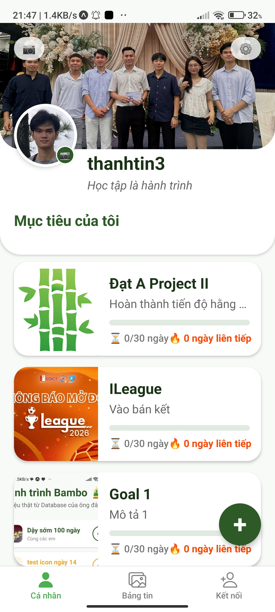
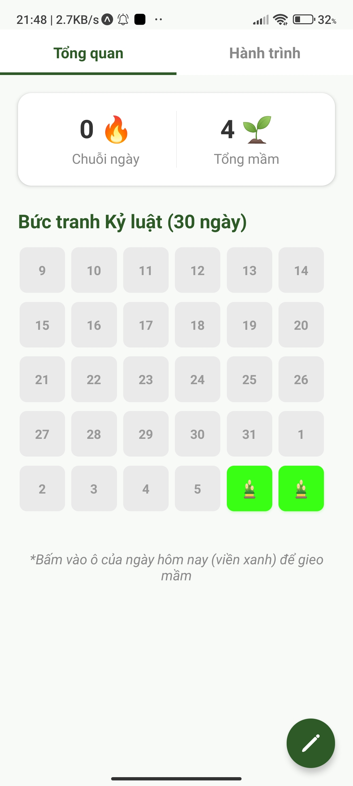
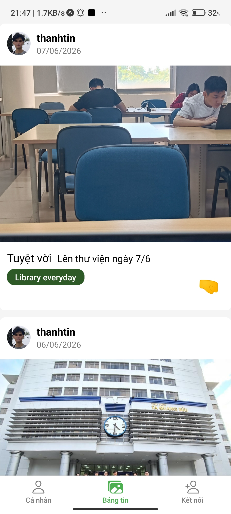
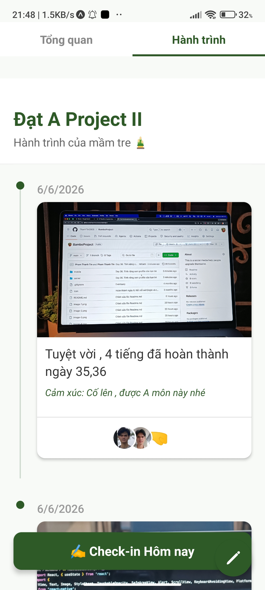
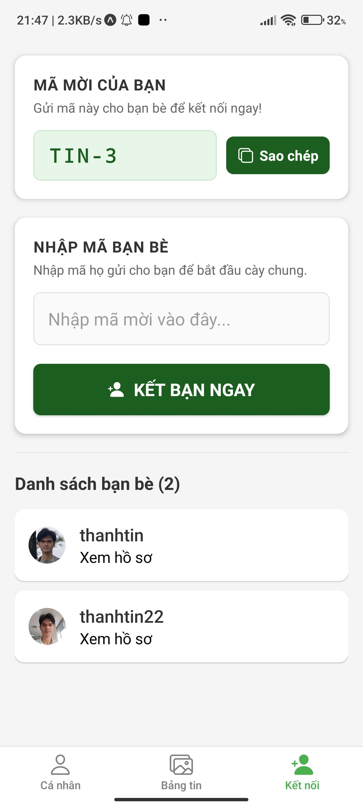

# 🎋 Bambo - Mạng xã hội phát triển bản thân 

---

## 📱 Giao diện & Tính năng Nổi bật (Screenshots)

**Bambo** được thiết kế với triết lý tối giản, tập trung vào kỷ luật cá nhân và loại bỏ hoàn toàn các chỉ số tương tác phù phiếm (Anti-Vanity Metrics) của mạng xã hội thông thường.

<table>
  <tr>
    <td align="center"><b>Profile</b></td>
    <td align="center"><b>Goal Overview</b></td>
    <td align="center"><b>Discover</b></td>
  </tr>
  <tr>
    <td align="center"></td>
    <td align="center"></td>
    <td align="center"></td>
  </tr>
  <tr>
    <td align="center">Trang cá nhân của người dùng ,chứa thông tin các mục tiêu (Project II, ILeague...). </td>
    <td align="center">Theo dõi thực hiện trong 30 ngày. Khi một thói quen tốt đã được thiết lập, người dùng sẽ cố gắng để duy trì thói quen đó . </td>
    <td align="center">Màn hình khám phá các logs (nhật ký) của bạn bè , có thêm cơ chế thả cảm xúc 🤜 , để chia sẻ tinh thần nỗ lực . </td>
  </tr>
</table>

<table>
  <tr>
    <td align="center"><b>Goal Timeline</b></td>
    <td align="center"><b>Add Friends</b></td>
  </tr>
  <tr>
    <td align="center"></td>
    <td align="center"></td>
  </tr>
  <tr>
    <td align="center">Theo dõi chi tiết các hoạt động theo từng ngày để hướng đến mục tiêu </td>
    <td align="center">Kết bạn (phiên bản đơn giản) , dựa vào việc nhập code tương ứng với từng tài khoản người dùng .</td>
  </tr>
</table>
