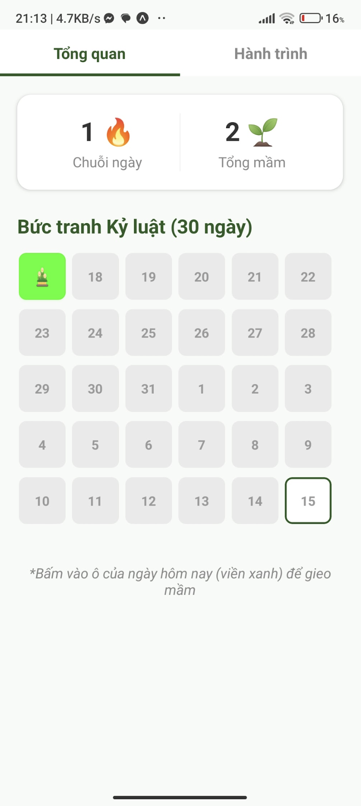
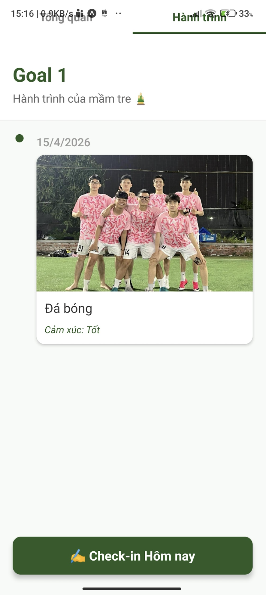
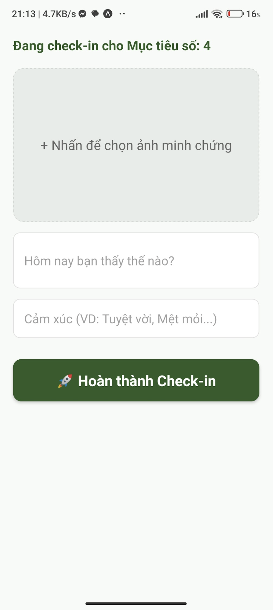

# 🎋 Bambo - Social Networking & Task Management App

<p align="center">
  
  <br>
  <b>Một ứng dụng di động kết hợp không gian mạng xã hội trực quan và công cụ quản lý công việc hiệu quả.</b>
  <br>
  <sub>Xây dựng bởi Phạm Thành Tín</sub>
</p>

---

## 📱 Giao diện ứng dụng (UI Screenshots & Demo)

> **Mẹo:** Bạn hãy chụp ảnh màn hình, ghép vào khung mockup điện thoại (hoặc giữ nguyên tỉ lệ dọc) rồi lưu vào một thư mục như `docs/screenshots/` trong repo để chèn link vào đây nhé.

### 👥 Trải nghiệm Mạng xã hội (Social Features)


### 📋 Quản lý Công việc (Task Management)




---

## ✨ Tính năng nổi bật (Features)

### 🎨 Frontend & UI/UX (Đã hoàn thiện)
* [x] **Dark/Light Mode:** Hỗ trợ giao diện sáng/tối linh hoạt, bảo vệ mắt.
* [x] **Social Feed UI:** Giao diện lướt tin mịn màng, tối ưu không gian hiển thị hình ảnh và tương tác.
* [x] **Kanban Board:** Thiết kế bảng quản lý công việc trực quan, dễ dàng phân loại trạng thái (To Do, In Progress, Done).
* [x] **Responsive Design:** Hiển thị chuẩn nét trên nhiều kích thước màn hình thiết bị khác nhau.

### ⚙️ Backend & Logic (Đang phát triển)
* [ ] Tích hợp xác thực người dùng (Authentication) qua Supabase.
* [ ] Đồng bộ hóa dữ liệu thời gian thực (Real-time database) cho các hành động tương tác và cập nhật trạng thái Task.
* [ ] Hệ thống thông báo đẩy (Push Notifications) khi có tương tác mới hoặc sắp tới deadline.

---

## 🛠️ Công nghệ sử dụng (Tech Stack)

* **Frontend:** React Native / Expo *(hoặc sửa thành Flutter/React tùy công nghệ của bạn)*
* **Styling:** Tailwind CSS / NativeWind
* **Backend & Database (Định hướng):** Supabase (Auth, PostgreSQL, Storage)
* **State Management:** React Context API / Redux Toolkit

---

## 🚀 Hướng dẫn cài đặt & Chạy thử (Local Setup)

Để chạy thử giao diện của ứng dụng trên môi trường máy cục bộ, hãy làm theo các bước sau:

### 1. Yêu cầu hệ thống
* NodeJS (v18 trở lên)
* Git

### 2. Các bước thực hiện

```bash
# Clone dự án về máy
git clone [https://github.com/](https://github.com/)[username_github_cua_ban]/bambo.git

# Di chuyển vào thư mục dự án
cd bambo

# Cài đặt các gói thư viện phụ thuộc
npm install
# hoặc nếu dùng yarn: yarn install

# Khởi chạy ứng dụng ở chế độ Development
npm start
# hoặc: expo start