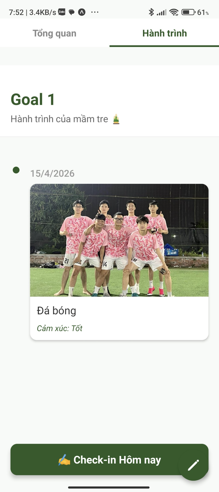

# 🎋 Bambo - Mạng xã hội phát triển bản thân 

---

## 📱 Giao diện ứng dụng (UI Screenshots & Demo)

### 👥 Trải nghiệm Mạng xã hội (Social Features)
<table>
  <tr>
    <td></td>
    <td></td>
  </tr>
  <tr>
    <td align="center"><em>Màn hình Profile</em></td>
    <td align="center"><em>Màn hình Khám phá</em></td>
  </tr>
</table>

### 📋 Quản lý Mục tiêu (Goal Features)
<table>
  <tr>
    <td></td>
    <td></td>
    <td></td>
  </tr>
  <tr>
    <td align="center"><em>Theo dõi quá trình</em></td>
    <td align="center"><em>Minh chứng hoạt động</em></td>
    <td align="center"><em>Check in</em></td>
  </tr>
</table>
---

